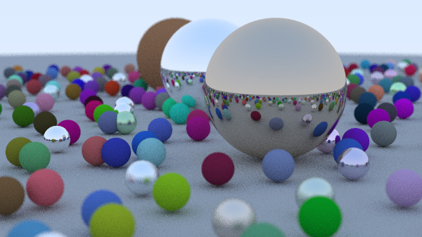

# Generic Ray Tracer with C++
A Ray Tracer is a computer graphics technique used to generate images by tracing the path of light through pixels in an image plane. It simulates the effects of interactions between light and objects to produce realistic images.

## Result

